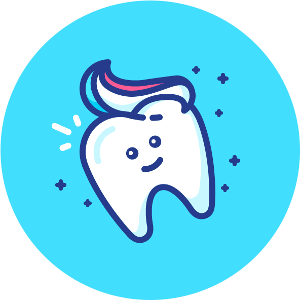

  

  <h3 align="center">Toothie</h3>

  

    A dental clinic responsive website using HTML, BOOTSTRAP 5 and SASS with SEO.
     
     
    <a href="https://toothie.netlify.app/">View Demo</a>
    ·
    <a href="https://github.com/aleiva17/toothie-ch/issues">Report Bug</a>
  

## About The Project

### Main Page
[![Toothie Main Page][website-main-page]](https://toothie.netlify.app/)

### Built With

This project was done with the following technologies and libraries.

* [Sass](https://sass-lang.com/)
* [Bootstrap](https://getbootstrap.com)
* [Font Awesome](https://fontawesome.com/)

## License

Distributed under the MIT License. See `LICENSE.txt` for more information.

## Contact

Andrés Leiva - aleiva1700@gmail.com

[website-main-page]: https://i.imgur.com/qwjxGaW.jpg